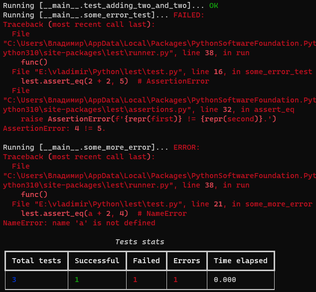

# Lest

## Light Python library for testing

## Installing

Just enter in command line:

```shell
pip install lest
```

## Usage

### Example:

Code:

```python
from lest import register, run, setup


@setup
def my_setup():
    print('Setup ran!')


@register
def test_adding_two_and_two():
    assert 2 + 2 == 4


@register
def some_error_test():
    assert 2 + 2 == 5  # AssertionError


@register
def some_more_error():
    assert a + 2 == 4  # NameError


run()
```

Output (to visible the highlighting, it's a print-screen):


